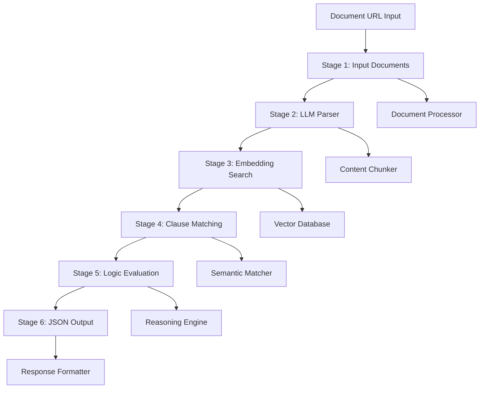
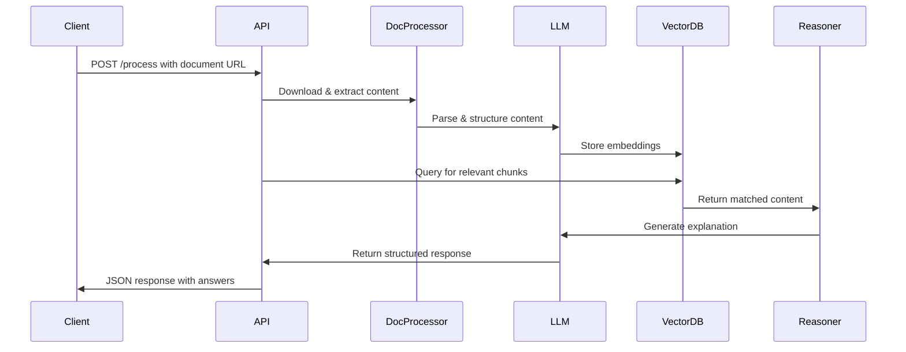

# Design Document

## Overview

The LLM Document Processing System implements a sophisticated 6-stage pipeline that transforms raw document inputs into intelligent, structured responses. The system leverages advanced AI technologies including large language models, semantic embeddings, and vector databases to provide explainable document analysis with high accuracy and performance.

### System Architecture

The system follows a modular, pipeline-based architecture with clear separation of concerns:



## Architecture

### Core Components

#### 1. Document Processing Engine
- **Multi-format Support**: Handles PDF, DOCX, and email documents
- **Content Extraction**: Preserves document structure and metadata
- **Error Handling**: Robust download and parsing error management
- **Caching**: Intelligent caching for frequently accessed documents

#### 2. LLM Integration Layer
- **Model Management**: Supports multiple LLM providers (Google Gemini, OpenAI, etc.)
- **Prompt Engineering**: Optimized prompts for document analysis tasks
- **Response Processing**: Structured output parsing and validation
- **Rate Limiting**: API usage optimization and throttling

#### 3. Vector Database System
- **FAISS Integration**: High-performance local vector search
- **Pinecone Support**: Cloud-based vector database option
- **Embedding Management**: Efficient storage and retrieval of document embeddings
- **Index Optimization**: Dynamic index management for optimal performance

#### 4. Semantic Processing Pipeline
- **Chunk Generation**: Intelligent document segmentation
- **Embedding Creation**: State-of-the-art sentence transformers
- **Similarity Matching**: Advanced semantic similarity algorithms
- **Context Preservation**: Maintains document context across chunks

#### 5. API Gateway
- **RESTful Interface**: Clean, documented API endpoints
- **Authentication**: Secure token-based authentication
- **Request Validation**: Comprehensive input validation and sanitization
- **Response Formatting**: Consistent JSON response structure

### Data Flow Architecture



## Components and Interfaces

### Stage 1: Input Documents Component

**Purpose**: Handle multi-format document ingestion and preprocessing

**Interface**:
```python
class DocumentProcessor:
    def download_document(self, url: str) -> DocumentContent
    def detect_format(self, content: bytes) -> DocumentType
    def extract_content(self, document: DocumentContent) -> ExtractedContent
    def validate_document(self, content: ExtractedContent) -> ValidationResult
```

**Key Features**:
- Support for PDF, DOCX, and email formats
- Secure document download with validation
- Content type detection and format-specific processing
- Metadata preservation and extraction

### Stage 2: LLM Parser Component

**Purpose**: Intelligent content parsing and structuring using LLM capabilities

**Interface**:
```python
class LLMParser:
    def parse_content(self, content: ExtractedContent) -> ParsedContent
    def create_chunks(self, parsed_content: ParsedContent) -> List[ContentChunk]
    def extract_structure(self, content: ExtractedContent) -> DocumentStructure
    def identify_clauses(self, content: ExtractedContent) -> List[Clause]
```

**Key Features**:
- Semantic content segmentation
- Clause and term identification
- Document structure preservation
- Context-aware chunking strategies

### Stage 3: Embedding Search Component

**Purpose**: Vector-based semantic search using FAISS or Pinecone

**Interface**:
```python
class EmbeddingSearchEngine:
    def create_embeddings(self, chunks: List[ContentChunk]) -> List[Embedding]
    def build_index(self, embeddings: List[Embedding]) -> VectorIndex
    def search_similar(self, query: str, top_k: int) -> List[SearchResult]
    def update_index(self, new_embeddings: List[Embedding]) -> None
```

**Key Features**:
- High-performance vector similarity search
- Support for both FAISS (local) and Pinecone (cloud)
- Dynamic index management and updates
- Configurable similarity thresholds

### Stage 4: Clause Matching Component

**Purpose**: Specialized semantic matching for legal and policy documents

**Interface**:
```python
class ClauseMatcher:
    def match_clauses(self, query: str, clauses: List[Clause]) -> List[ClauseMatch]
    def find_related_clauses(self, clause: Clause) -> List[RelatedClause]
    def categorize_clauses(self, clauses: List[Clause]) -> Dict[str, List[Clause]]
    def extract_obligations(self, clauses: List[Clause]) -> List[Obligation]
```

**Key Features**:
- Legal document-specific matching algorithms
- Clause relationship mapping
- Obligation and rights extraction
- Confidence scoring for matches

### Stage 5: Logic Evaluation Component

**Purpose**: Explainable reasoning and decision processing

**Interface**:
```python
class LogicEvaluator:
    def evaluate_query(self, query: str, context: List[ContentChunk]) -> Evaluation
    def generate_explanation(self, evaluation: Evaluation) -> Explanation
    def resolve_conflicts(self, conflicting_info: List[ContentChunk]) -> Resolution
    def calculate_confidence(self, evidence: List[Evidence]) -> ConfidenceScore
```

**Key Features**:
- Step-by-step reasoning chains
- Evidence-based decision making
- Conflict resolution logic
- Confidence scoring and uncertainty handling

### Stage 6: JSON Output Component

**Purpose**: Structured response generation and formatting

**Interface**:
```python
class ResponseFormatter:
    def format_response(self, evaluation: Evaluation) -> JSONResponse
    def include_metadata(self, response: JSONResponse, metadata: ProcessingMetadata) -> JSONResponse
    def validate_schema(self, response: JSONResponse) -> ValidationResult
    def optimize_response(self, response: JSONResponse) -> OptimizedResponse
```

**Key Features**:
- Standardized JSON schema
- Comprehensive metadata inclusion
- Response validation and optimization
- Error handling and status reporting

## Data Models

### Core Data Structures

```python
@dataclass
class DocumentContent:
    url: str
    content_type: str
    raw_content: bytes
    metadata: Dict[str, Any]
    timestamp: datetime

@dataclass
class ContentChunk:
    id: str
    content: str
    document_id: str
    page_number: Optional[int]
    section: Optional[str]
    chunk_type: ChunkType
    metadata: Dict[str, Any]

@dataclass
class Clause:
    id: str
    content: str
    clause_type: ClauseType
    obligations: List[str]
    conditions: List[str]
    references: List[str]
    confidence: float

@dataclass
class ProcessingResult:
    success: bool
    answers: List[str]
    explanations: List[Explanation]
    sources: List[Source]
    confidence_scores: List[float]
    processing_time: float
    metadata: ProcessingMetadata
```

### Response Schema

```json
{
  "success": true,
  "processing_id": "uuid",
  "timestamp": "2024-01-01T00:00:00Z",
  "document_info": {
    "type": "pdf",
    "pages": 10,
    "size_bytes": 1024000,
    "processing_time_ms": 5000
  },
  "results": [
    {
      "query": "What are the payment terms?",
      "answer": "Payment is due within 30 days of invoice date.",
      "confidence": 0.95,
      "explanation": {
        "reasoning_steps": ["Step 1", "Step 2"],
        "evidence": ["Source 1", "Source 2"],
        "alternatives": []
      },
      "sources": [
        {
          "chunk_id": "chunk_123",
          "page": 3,
          "section": "Payment Terms",
          "relevance_score": 0.92
        }
      ]
    }
  ],
  "metadata": {
    "chunks_processed": 45,
    "embeddings_created": 45,
    "search_time_ms": 150,
    "llm_calls": 3,
    "total_tokens": 2500
  }
}
```

## Error Handling

### Error Categories and Responses

1. **Document Processing Errors**
   - Invalid URL or inaccessible document
   - Unsupported document format
   - Corrupted or malformed content
   - Size limitations exceeded

2. **LLM Processing Errors**
   - API rate limits or quota exceeded
   - Model unavailability or timeout
   - Invalid or malformed responses
   - Content policy violations

3. **Vector Database Errors**
   - Index creation or update failures
   - Search query errors
   - Connection or authentication issues
   - Resource limitations

4. **System Errors**
   - Memory or storage limitations
   - Network connectivity issues
   - Configuration errors
   - Authentication failures

### Error Response Format

```json
{
  "success": false,
  "error": {
    "code": "DOCUMENT_PROCESSING_ERROR",
    "message": "Failed to extract content from PDF",
    "details": {
      "stage": "input_documents",
      "cause": "Corrupted PDF structure",
      "retry_possible": false
    },
    "timestamp": "2024-01-01T00:00:00Z",
    "request_id": "uuid"
  }
}
```

## Testing Strategy

### Unit Testing
- Individual component testing with mocked dependencies
- Data model validation and serialization testing
- Error handling and edge case coverage
- Performance benchmarking for critical paths

### Integration Testing
- End-to-end pipeline testing with real documents
- API endpoint testing with various input scenarios
- Vector database integration testing
- LLM integration and response validation

### Performance Testing
- Load testing with concurrent requests
- Large document processing benchmarks
- Memory usage and resource optimization
- Scalability testing under various loads

### Security Testing
- Input validation and sanitization testing
- Authentication and authorization testing
- Data privacy and secure handling validation
- Vulnerability scanning and penetration testing

## Deployment and Scalability

### Infrastructure Requirements
- **Compute**: CPU-optimized instances for document processing
- **Memory**: High-memory instances for vector operations
- **Storage**: Fast SSD storage for temporary document processing
- **Network**: High-bandwidth for document downloads and API responses

### Scaling Strategies
- **Horizontal Scaling**: Multiple API instances behind load balancer
- **Vertical Scaling**: Increased resources for compute-intensive operations
- **Caching**: Redis-based caching for frequently accessed documents
- **Queue Management**: Asynchronous processing for large documents

### Monitoring and Observability
- **Metrics**: Response times, throughput, error rates, resource utilization
- **Logging**: Structured logging with correlation IDs
- **Alerting**: Automated alerts for system health and performance issues
- **Dashboards**: Real-time monitoring and historical trend analysis