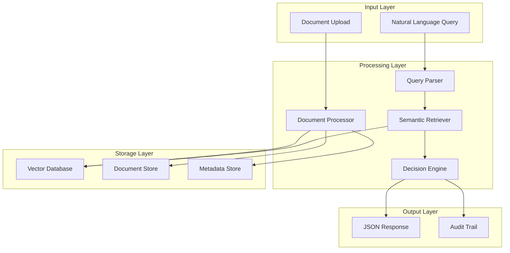
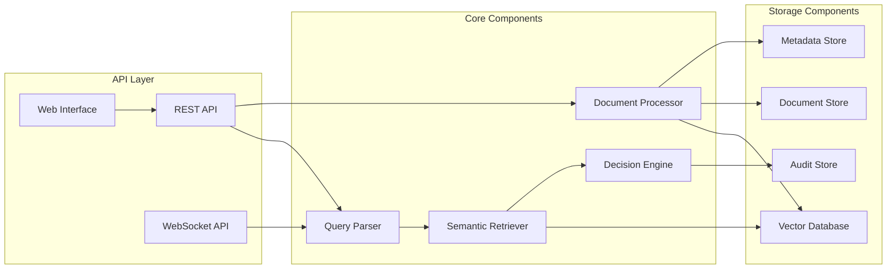
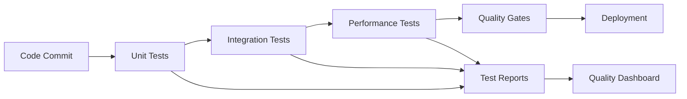

# Design Document

## Overview

The LLM Document Processing System is designed as a modular, scalable architecture that processes natural language queries against large unstructured documents. The system builds upon the existing insurance claim processor architecture, extending it to handle broader document types and use cases while maintaining the core semantic search and decision-making capabilities.

The system follows a 4-stage pipeline:
1. **Query Processing** - Parse and structure natural language input
2. **Document Ingestion** - Process and index various document formats
3. **Semantic Retrieval** - Find relevant content using vector similarity
4. **Decision Engine** - Apply business logic and generate structured responses

## Architecture

### High-Level Architecture



### Component Architecture

The system extends the existing modular architecture with enhanced capabilities:



## Components and Interfaces

### 1. Enhanced Query Parser

**Purpose**: Parse natural language queries and extract structured information

**Key Enhancements**:
- Support for multiple domain types (insurance, legal, HR, contracts)
- Improved entity extraction using advanced NLP models
- Query intent classification
- Confidence scoring for extracted entities

**Interface**:
```python
class EnhancedQueryParser:
    def parse_query(self, query: str, domain: str = "insurance") -> ParsedQuery
    def extract_entities(self, query: str) -> Dict[str, Any]
    def classify_intent(self, query: str) -> QueryIntent
    def validate_completeness(self, parsed_query: ParsedQuery) -> ValidationResult
```

### 2. Universal Document Processor

**Purpose**: Process various document formats and extract structured content

**Key Features**:
- Support for PDF, DOCX, EML, TXT, and HTML formats
- Intelligent text extraction with layout preservation
- Metadata extraction and document classification
- Chunking strategies optimized for different document types

**Interface**:
```python
class UniversalDocumentProcessor:
    def process_document(self, file_path: str) -> ProcessedDocument
    def extract_text(self, file_path: str) -> str
    def extract_metadata(self, file_path: str) -> DocumentMetadata
    def chunk_document(self, document: ProcessedDocument) -> List[DocumentChunk]
    def classify_document(self, document: ProcessedDocument) -> DocumentType
```

### 3. Advanced Semantic Retriever

**Purpose**: Perform semantic search and retrieve relevant document sections

**Key Enhancements**:
- Multi-vector search strategies
- Hybrid search combining semantic and keyword matching
- Query expansion and reformulation
- Result ranking and filtering

**Interface**:
```python
class AdvancedSemanticRetriever:
    def search_relevant_content(self, query: ParsedQuery, top_k: int = 10) -> List[RelevantContent]
    def hybrid_search(self, query: str, filters: Dict = None) -> List[SearchResult]
    def expand_query(self, query: str) -> List[str]
    def rank_results(self, results: List[SearchResult], query: ParsedQuery) -> List[RankedResult]
```

### 4. Configurable Decision Engine

**Purpose**: Apply business logic and generate structured decisions

**Key Features**:
- Rule-based and ML-based decision making
- Configurable business rules per domain
- Confidence scoring and uncertainty handling
- Detailed justification generation

**Interface**:
```python
class ConfigurableDecisionEngine:
    def evaluate_query(self, query: ParsedQuery, relevant_content: List[RelevantContent]) -> Decision
    def apply_business_rules(self, context: DecisionContext) -> RuleResult
    def generate_justification(self, decision: Decision) -> DetailedJustification
    def calculate_confidence(self, decision: Decision) -> float
```

## Data Models

### Core Data Models

```python
@dataclass
class ParsedQuery:
    raw_query: str
    entities: Dict[str, Any]
    intent: QueryIntent
    domain: str
    confidence_scores: Dict[str, float]
    missing_entities: List[str]
    assumptions: List[str]

@dataclass
class ProcessedDocument:
    document_id: str
    file_path: str
    document_type: DocumentType
    metadata: DocumentMetadata
    content: str
    chunks: List[DocumentChunk]
    processing_timestamp: datetime

@dataclass
class DocumentChunk:
    chunk_id: str
    document_id: str
    content: str
    metadata: Dict[str, Any]
    embedding: Optional[List[float]]
    chunk_type: ChunkType
    position: int

@dataclass
class RelevantContent:
    content_id: str
    document_id: str
    chunk_id: str
    content: str
    relevance_score: float
    content_type: ContentType
    source_metadata: Dict[str, Any]

@dataclass
class Decision:
    decision_id: str
    status: DecisionStatus
    amount: Optional[float]
    justification: DetailedJustification
    confidence_score: float
    mapped_content: List[MappedContent]
    processing_metadata: ProcessingMetadata
    audit_trail: AuditTrail
```

### Supporting Models

```python
class QueryIntent(Enum):
    CLAIM_EVALUATION = "claim_evaluation"
    POLICY_INQUIRY = "policy_inquiry"
    COVERAGE_CHECK = "coverage_check"
    DOCUMENT_SEARCH = "document_search"

class DocumentType(Enum):
    POLICY = "policy"
    CONTRACT = "contract"
    EMAIL = "email"
    LEGAL_DOCUMENT = "legal_document"
    MANUAL = "manual"

class DecisionStatus(Enum):
    APPROVED = "approved"
    REJECTED = "rejected"
    PENDING = "pending"
    INSUFFICIENT_INFO = "insufficient_info"

@dataclass
class DetailedJustification:
    summary: str
    reasoning_steps: List[ReasoningStep]
    supporting_evidence: List[Evidence]
    conflicting_evidence: List[Evidence]
    assumptions_made: List[str]

@dataclass
class MappedContent:
    content_id: str
    document_name: str
    section: str
    page_number: Optional[int]
    content_snippet: str
    relevance_to_decision: str
    weight_in_decision: float
```

## Error Handling

### Error Classification

1. **Input Validation Errors**
   - Invalid query format
   - Unsupported document types
   - Missing required parameters

2. **Processing Errors**
   - Document parsing failures
   - Embedding generation errors
   - Search index unavailable

3. **Business Logic Errors**
   - Insufficient information for decision
   - Conflicting rules or policies
   - Confidence threshold not met

4. **System Errors**
   - Database connection failures
   - External API timeouts
   - Resource exhaustion

### Error Response Format

```python
@dataclass
class ErrorResponse:
    error_code: str
    error_message: str
    error_type: ErrorType
    details: Dict[str, Any]
    suggestions: List[str]
    retry_possible: bool
    timestamp: datetime
```

### Error Handling Strategy

```python
class ErrorHandler:
    def handle_validation_error(self, error: ValidationError) -> ErrorResponse
    def handle_processing_error(self, error: ProcessingError) -> ErrorResponse
    def handle_business_error(self, error: BusinessError) -> ErrorResponse
    def handle_system_error(self, error: SystemError) -> ErrorResponse
    def log_error(self, error: Exception, context: Dict[str, Any]) -> None
```

## Testing Strategy

### Unit Testing

- **Query Parser Tests**: Entity extraction accuracy, intent classification
- **Document Processor Tests**: Format support, text extraction quality
- **Semantic Retriever Tests**: Search relevance, ranking accuracy
- **Decision Engine Tests**: Business rule application, justification quality

### Integration Testing

- **End-to-End Pipeline Tests**: Complete query processing workflows
- **API Integration Tests**: REST endpoint functionality and error handling
- **Database Integration Tests**: Data persistence and retrieval
- **External Service Tests**: LLM API integration and fallback mechanisms

### Performance Testing

- **Load Testing**: Concurrent query processing capabilities
- **Stress Testing**: System behavior under resource constraints
- **Scalability Testing**: Performance with large document sets
- **Latency Testing**: Response time optimization

### Test Data Strategy

```python
class TestDataManager:
    def create_test_documents(self, document_types: List[DocumentType]) -> List[TestDocument]
    def create_test_queries(self, complexity_levels: List[str]) -> List[TestQuery]
    def create_expected_results(self, queries: List[TestQuery]) -> List[ExpectedResult]
    def validate_test_coverage(self) -> CoverageReport
```

### Automated Testing Pipeline



## Performance and Scalability Considerations

### Caching Strategy

- **Query Result Caching**: Cache frequent query patterns and results
- **Embedding Caching**: Store document embeddings for reuse
- **Metadata Caching**: Cache document metadata and classifications

### Database Optimization

- **Vector Database**: Optimized indexing for semantic search
- **Document Store**: Efficient storage and retrieval of large documents
- **Metadata Indexing**: Fast filtering and sorting capabilities

### Horizontal Scaling

- **Microservices Architecture**: Independent scaling of components
- **Load Balancing**: Distribute queries across multiple instances
- **Async Processing**: Non-blocking operations for better throughput

### Resource Management

```python
class ResourceManager:
    def monitor_memory_usage(self) -> MemoryMetrics
    def optimize_embedding_storage(self) -> OptimizationResult
    def manage_concurrent_requests(self, max_concurrent: int) -> None
    def cleanup_temporary_resources(self) -> None
```

## Security and Compliance

### Data Protection

- **Encryption**: At-rest and in-transit encryption for sensitive documents
- **Access Control**: Role-based access to documents and queries
- **Data Anonymization**: PII detection and masking capabilities

### Audit and Compliance

- **Audit Trail**: Complete traceability of all decisions and data access
- **Compliance Reporting**: Generate reports for regulatory requirements
- **Data Retention**: Configurable retention policies for different data types

### Security Measures

```python
class SecurityManager:
    def authenticate_user(self, credentials: UserCredentials) -> AuthResult
    def authorize_document_access(self, user: User, document: Document) -> bool
    def encrypt_sensitive_data(self, data: str) -> EncryptedData
    def audit_user_action(self, user: User, action: Action, context: Dict) -> None
```

## Deployment Architecture

### Container-Based Deployment

```yaml
# docker-compose.yml structure
services:
  api-gateway:
    image: nginx:alpine
    ports: ["80:80", "443:443"]
  
  query-processor:
    image: llm-processor:latest
    replicas: 3
    
  document-processor:
    image: doc-processor:latest
    replicas: 2
    
  vector-db:
    image: qdrant/qdrant:latest
    volumes: ["vector_data:/qdrant/storage"]
    
  document-store:
    image: postgres:15
    volumes: ["doc_data:/var/lib/postgresql/data"]
```

### Monitoring and Observability

- **Application Metrics**: Response times, error rates, throughput
- **Business Metrics**: Decision accuracy, user satisfaction
- **Infrastructure Metrics**: Resource utilization, system health
- **Distributed Tracing**: Request flow across microservices

This design provides a robust, scalable foundation for the LLM Document Processing System while building on the existing insurance claim processor architecture. The modular design allows for easy extension to new domains and document types while maintaining high performance and reliability.